## OC-AND: A Citation-Enriched Benchmark for Author Name Disambiguation

Author Name Disambiguation benchmarks are predominantly derived from closed infrastructures that may not reflect conditions in open bibliographic environments. We present OC-AND, an open citation-enriched benchmark for AND constructed by remapping the WhoIsWho dataset with bibliographic and citation metadata from OpenCitations. The dataset is produced through a reproducible five-stage pipeline involving DOI verification, metadata validation, OpenCitations enrichment, and author-centric transformation. OC-AND preserves the original ground-truth author identities and partition structure of WhoIsWho while introducing realistic characteristics of open citation environments: heterogeneous metadata completeness, absent abstracts and affiliations, asymmetric citation coverage, and sparse graph connectivity. The dataset contains author records with associated citations, enabling evaluation of AND methods in settings closer to real-world open scholarly infrastructure scenarios. OC-AND is released as open data with complete provenance documentation and pipeline code, supporting reproducible research and the development of citation-aware disambiguation approaches. The entire pipeline used to create OC-AND is here available for reproducibility. 

```mermaid
flowchart LR
    %% Palette colori coerente con TikZ
    classDef s1 fill:#e8eff7,stroke:#1c4e80,stroke-width:2px,color:#1c4e80;
    classDef s2 fill:#e6f4f4,stroke:#007373,stroke-width:2px,color:#007373;
    classDef s3 fill:#edf7ef,stroke:#2d7d41,stroke-width:2px,color:#2d7d41;
    classDef s4 fill:#fdf4eb,stroke:#af5f14,stroke-width:2px,color:#af5f14;
    classDef s5 fill:#f4ebf7,stroke:#692d87,stroke-width:2px,color:#692d87;
    classDef fileNode fill:#f8f9fb,stroke:#b9c0ca,stroke-width:1px,color:#222;

    %% Input iniziale
    IN(["gold_standard.csv"]):::fileNode --> S1

    %% Riga Superiore: Stage 1 -> Stage 2 -> Stage 3
    S1["<b>Stage 1: Gold Standard Prep</b><br/><i>process_gold_standard_1.py</i><br/>• Manual DOI verification (N=500)<br/>• AMiner portal queries &amp; title checks<br/>• Stratified Train/Valid split"]:::s1

    S2["<b>Stage 2: Cutoff Calibration</b><br/><i>crossref_query_2.py</i><br/>• Crossref BM25 score grid search<br/>• Accuracy optimization criterion<br/>• Year agreement check (Phi_valid)"]:::s2

    S3["<b>Stage 3: Large-Scale Validation</b><br/><i>crossref_query_for_Bond_3.py</i><br/>• Full benchmark DOI resolution<br/>• Multiprocessing Crossref queries<br/>• Filtering: S_cr ≥ tau_op &amp; Phi_valid"]:::s3

    S1 -->|"valid_set.csv<br/>train_set.csv"| S2
    S2 -->|"<b>Calibrated Cutoff</b><br/>tau_op = 35.00"| S3

    %% Discesa da Riga 1 a Riga 2
    S3 -->|"validated_keys_dois.csv"| S4

    %% Riga Inferiore: Stage 4 -> Stage 5 -> Output
    S4["<b>Stage 4: OpenCitations Enrichment</b><br/><i>opencitations_query_4.py</i><br/>• OpenCitations META API: metadata<br/>• OpenCitations INDEX API: citations<br/>• Local JSON caching"]:::s4

    S5["<b>Stage 5: Author-Centric Transform</b><br/><i>sna_raw_creation.py</i><br/>• Author name normalization<br/>• Mapping paper IDs to authors<br/>• Preserving ground-truth clusters"]:::s5

    OUT["<b>OC-AND Benchmark:</b><br/>converted_metadata_raw.json<br/><i>(Author-Centric Dataset)</i>"]:::fileNode

    S4 -->|"converted_metadata.json<br/><b>(Paper-Centric)</b>"| S5
    S5 --> OUT
```



### INFO ARTICOLO

## 📋 Indice

- [Panoramica](#-panoramica)
- [Rapida guida all'uso](#-guida-alluso)
- [Requisiti](#-requisiti)
- [Struttura della pipeline](#-struttura-della-pipeline)
- [File di Output](#-file-di-output)
- [Note Tecniche](#-note-tecniche)

---

## 🎯 Panoramica
Pipeline completa per l'estrazione, validazione e arricchimento di metadati bibliografici utilizzando Crossref e OpenCitations.

### Flusso Completo

```
Gold Standard CSV
      ↓
[process_gold_standard_1.py]
      ↓
Training/Validation Sets
      ↓
[crossref_query_2.py] → Analisi e ottimizzazione cutoff
      ↓
[crossref_query_for_Bond_3.py] → Validazione massiva
      ↓
validated_keys_dois.csv
      ↓
[opencitations_query_4.py] → Metadati + Citazioni
      ↓
converted_metadata.json
      ↓
[sna_raw_creation.py] → Formato autore-centrico
      ↓
converted_metadata_raw.json
```

---
## 🚀 Guida all'Uso

### Workflow Completo

#### Step 1: Prepara Gold Standard
```bash
python process_gold_standard_1.py
```
✅ Controlla `results/training_set.csv` e `results/validation_set.csv`

#### Step 2: Trova Cutoff Ottimale
```bash
python crossref_query_2.py
```
✅ Guarda `results/crossref_score_analysis.png` per il cutoff suggerito

#### Step 3: Valida Dataset Completo
```bash
# Aggiorna il cutoff in crossref_query_for_Bond_3.py
# Poi esegui:
python crossref_query_for_Bond_3.py
```
✅ Controlla `results/Bond_crossref_validated/validated_keys_dois.csv`

#### Step 4: Recupera Metadati OpenCitations
```bash
python opencitations_query_4.py

# Seleziona modalità:
# 1 = Solo metadati
# 2 = Metadati + citazioni (lento)
```
✅ Controlla `results/OC_results/converted_metadata.json`

#### Step 5: Crea Formato Autore-Centrico
```bash
python sna_raw_creation.py
```
✅ Controlla `results/converted_metadata_raw.json`

---

## 📁 File di Output

### Struttura Directory Results
```
results/
├── training_set.csv
├── validation_set.csv
├── failed_requests.csv
├── crossref_score_analysis.png
├── crossref_cutoff_analysis.csv
├── validation_results.csv
├── validation_metrics.json
├── wrong_matches_analysis.csv
├── crossref_cache.json
├── Bond_crossref_validated/
│   ├── validated_keys_dois.csv
│   ├── rejected_items.csv
│   └── error_items.csv
├── OC_results/
│   ├── converted_metadata.json
│   ├── opencitations_metadata.json
│   ├── final_batch_notfound.json
│   ├── processing_summary.json
│   ├── opencitations_cache.json
│   └── opencitations_app.log
├── OC_results_with_citations/
│   └── (stessi file di OC_results con citazioni)
└── converted_metadata_raw.json
```
---

## 💻 Requisiti

### Software
- Python 3.8+
- Connessione internet stabile

### Librerie Python
```bash
pip install requests
pip install chardet
pip install matplotlib
pip install python-Levenshtein
pip install tqdm
```

### Token API
- **OpenCitations Access Token** (gratuito): [Richiedi qui](https://opencitations.net/accesstoken)

---

## 🔧 Struttura della Pipeline

### 1. `process_gold_standard_1.py`

**Scopo**: Prepara il gold standard verificando i DOI su Crossref e dividendo in training/validation.

**Input**:
- `gold_standard.csv` - CSV con colonne: `Key`, `title`, `DOI`, `Cinese_title`

**Output**:
- `results/training_set.csv` - 300 esempi per training
- `results/validation_set.csv` - Rimanenti esempi per validazione
- `results/failed_requests.csv` - DOI con errori API

**Parametri Configurabili**:
```python
MAX_RETRIES = 3          # Tentativi per ogni richiesta
RETRY_DELAY = 5          # Secondi tra i retry
training_size = 300      # Dimensione training set
```

**Esecuzione**:
```bash
python process_gold_standard_1.py
```

---

### 2. `crossref_query_2.py`

**Scopo**: Analizza il training set per trovare il cutoff ottimale di Crossref score.

**Input**:
- `data/Bondvalidation.json` - Metadati paper in formato JSON
- `results/training_set.csv` - Training set preparato
- `results/validation_set.csv` - Validation set

**Output**:
- `results/crossref_score_analysis.png` - Grafico scatter plot
- `results/crossref_cutoff_analysis.csv` - Metriche per ogni cutoff
- `results/validation_results.csv` - Risultati validation set
- `results/crossref_training_cache.json` - Cache query Crossref
- `results/wrong_matches_analysis.csv` - Analisi errori

**Caratteristiche**:
-  Sistema di caching intelligente
-  Validazione con Levenshtein distance (similarità titoli)
-  Verifica esatta dell'anno
-  Calcolo automatico del cutoff ottimale

**Esecuzione**:
```bash
# Con cutoff automatico
python crossref_query_2.py

# Con cutoff manuale
# Modifica nel file: main(manual_cutoff=35.0)
```

**Metriche Calcolate**:
- Accuracy
- Precision
- Recall
- F1 Score

---

### 3. `crossref_query_for_Bond_3.py`

**Scopo**: Validazione massiva del dataset completo con multiprocessing.

**Input**:
- `data/Bondvalidation.json` - Dataset completo
- Cutoff ottimale da fase 2

**Output**:
- `results/Bond_crossref_validated/validated_keys_dois.csv` - Paper validati con DOI
- `results/Bond_crossref_validated/rejected_items.csv` - Paper rifiutati
- `results/Bond_crossref_validated/error_items.csv` - Paper con errori
- `results/crossref_cache.json` - Cache globale

**Parametri Configurabili**:
```python
manual_cutoff = 35.0      # Cutoff Crossref score
num_processes = 4         # Processi paralleli
use_cache = True          # Usa cache
```

**Caratteristiche**:
- Multiprocessing per velocizzare l'elaborazione
- Cache condivisa tra processi
- Validazione metadati (titolo + anno)

**Esecuzione**:
```bash
python crossref_query_for_Bond_3.py
```

---

### 4. `opencitations_query_4.py` 

**Scopo**: Recupera metadati bibliografici e citazioni da OpenCitations (API v2).

**Input**:
- `validated_keys_dois.csv` - Paper validati con DOI

**Output**:

**Modalità 1 - Standard** (`OC_results/`):
- `converted_metadata.json` - Metadati formato target
- `opencitations_metadata.json` - Metadati formato originale
- `final_batch_notfound.json` - DOI non trovati
- `processing_summary.json` - Statistiche
- `opencitations_cache.json` - Cache
- `opencitations_app.log` - Log dettagliato

**Modalità 2 - Con Citazioni** (`OC_results_with_citations/`):
- Stesso output della Modalità 1 +
- `outgoing_citations`: Lista DOI citati da questo paper
- `incoming_citations`: Lista DOI che citano questo paper
- `*_count`: Conteggi citazioni

**Formato Output Convertito**:
```json
{
  "paper_key": {
    "id": "paper_key",
    "title": "Paper Title",
    "abstract": "",
    "keywords": ["keyword1", "keyword2"],
    "authors": [
      {"name": "Author Name", "org": ""}
    ],
    "venue": "Journal Name",
    "year": 2020,
    "outgoing_citations": ["10.1234/doi1"],
    "incoming_citations": ["10.5678/doi2"],
    "outgoing_citations_count": 1,
    "incoming_citations_count": 1
  }
}
```

**Caratteristiche**:
- API OpenCitations v2 (META + INDEX)
- Due modalità di esecuzione
- Fase test con primi 100 DOI
- Caching 
- Gestione rate limiting
- Statistiche dettagliate

**Esecuzione**:
```bash
python opencitations_query_4.py

```

**Fasi di Esecuzione**:
1. **Selezione modalità** - Scegli se includere citazioni
2. **Test batch** - Elabora primi 100 DOI
3. **Verifica risultati** - Controlla file output
4. **Elaborazione completa** - Processa tutti i DOI (opzionale)
5. **Retry** - Riprova DOI falliti nelle esecuzioni successive


**API Endpoint Utilizzati e proprietà**:
```
META API:   https://api.opencitations.net/meta/v1/metadata/doi:{DOI}
INDEX API:  https://api.opencitations.net/index/v2/citations/doi:{DOI}
            https://api.opencitations.net/index/v2/references/doi:{DOI}
```

---

### 5. `sna_raw_creation.py`

**Scopo**: Converte metadati da formato paper-centrico a formato autore-centrico.

**Input**:
- `results/OC_results/converted_metadata.json`

**Output**:
- `results/converted_metadata_raw.json` - Formato autore → paper

**Formato Output**:
```json
{
  "mario_rossi": ["paper1", "paper2"],
  "john_doe": ["paper3"]
}
```

**Normalizzazione Nomi**:
- Lowercase
- Rimozione abbreviazioni (J. → j)
- Rimozione caratteri speciali
- Formato: `primo_nome_cognome`
- Limite: 100 caratteri

**Esecuzione**:
```bash
python sna_raw_creation.py
```

---


### 5. Prepara i Dati
Posiziona i tuoi file in:
```
data/
  ├── gold_standard.csv
  └── Bondvalidation.json
```


## 📝 Note Tecniche

### Normalizzazione DOI
I DOI vengono normalizzati rimuovendo:
- Prefissi: `https://doi.org/`, `http://doi.org/`, `doi.org/`, `DOI:`, `doi:`
- Convertiti in lowercase
- Spazi rimossi

### Validazione Metadati
La validazione richiede:
- **Titolo**: Similarità Levenshtein > 50% (opzionale)
- **Anno**: Match esatto
- **Autori**: Check disabilitato di default (opzionale)

### Cache Behavior
- Cache salvata ogni 100 richieste
- Backup automatico se corrotta
- Condivisa tra processi (multiprocessing)

### Problemi Comuni e Soluzioni

#### JSONDecodeError in OpenCitations
L'API restituisce HTML invece di JSON quando il DOI non esiste nel database. Il sistema marca automaticamente questi DOI come "non trovati".

#### Rate Limiting (HTTP 429)
Il sistema attende automaticamente quando viene raggiunto il rate limit. Se il problema persiste, aumentare `RATE_LIMIT_DELAY` in `opencitations_query_4.py`.

#### Token OpenCitations non valido
Richiedere un nuovo token gratuito su https://opencitations.net/accesstoken

#### Cache corrotta
Cancellare i file `*cache.json` e rieseguire gli script per rigenerare la cache.

---

**Versione**: 
**Ultimo Aggiornamento**: 

