# OC-AND: A Citation-Enriched Benchmark for Author Name Disambiguation

Author Name Disambiguation benchmarks are predominantly derived from closed infrastructures that may not reflect conditions in open bibliographic environments. We present OC-AND, an open citation-enriched benchmark for AND constructed by remapping the WhoIsWho dataset with bibliographic and citation metadata from OpenCitations. The dataset is produced through a reproducible five-stage pipeline involving DOI verification, metadata validation, OpenCitations enrichment, and author-centric transformation. OC-AND retains the WhoIsWho ground-truth files and partition structure unchanged, while its publication files are restricted to publications that could be matched to a validated DOI and an OpenCitations record. It introduces realistic characteristics of open environments: heterogeneous metadata completeness, absent abstracts and affiliations, asymmetric citation coverage, and sparse graph connectivity. The dataset contains author records with associated citations, enabling evaluation of AND methods in settings closer to real-world open scholarly infrastructure scenarios. OC-AND is released as open data with complete provenance documentation and pipeline code, supporting reproducible research and the development of citation-aware disambiguation approaches.


To cite this paper: 

To cite this repository: 
Cappelli, F., Colavizza, G., & Peroni, S. (2026). OC-AND (Version v1.0.0) [Computer software]. Zenodo. https://doi.org/10.5281/zenodo.23055587


## Indice

- [Panoramica](#panoramica)
- [Guida all'Uso](#guida-alluso)
- [File di Output](#file-di-output)
- [Requisiti](#requisiti)
- [Note Tecniche](#note-tecniche)

---

## Panoramica
Pipeline completa per l'estrazione, validazione e arricchimento di metadati bibliografici utilizzando Crossref e OpenCitations.

### Flusso Completo

```mermaid
flowchart LR
    %% Palette colori coerente con TikZ
    classDef s1 fill:#e8eff7,stroke:#1c4e80,stroke-width:2px,color:#1c4e80;
    classDef s2 fill:#e6f4f4,stroke:#007373,stroke-width:2px,color:#007373;
    classDef s3 fill:#edf7ef,stroke:#2d7d41,stroke-width:2px,color:#2d7d41;
    classDef s4 fill:#fdf4eb,stroke:#af5f14,stroke-width:2px,color:#af5f14;
    classDef s5 fill:#f4ebf7,stroke:#692d87,stroke-width:2px,color:#692d87;
    classDef fileNode fill:#f8f9fb,stroke:#b9c0ca,stroke-width:1px,color:#222;

    %% Input iniziale
    IN(["gold_standard.csv"]):::fileNode --> S1

    %% Riga Superiore: Stage 1 -> Stage 2 -> Stage 3
    S1["<b>Stage 1: Gold Standard Prep</b><br/><i>step1_prepare_gold_standard.py</i><br/>• Manual DOI verification (N=500)<br/>• AMiner portal queries &amp; title checks<br/>• Stratified Train/Valid split"]:::s1

    S2["<b>Stage 2: Cutoff Calibration</b><br/><i>step2_calibrate_crossref_cutoff.py</i><br/>• Crossref BM25 score grid search<br/>• Accuracy optimization criterion<br/>• Year agreement check (Phi_valid)"]:::s2

    S3["<b>Stage 3: Large-Scale Validation</b><br/><i>step3_validate_crossref_dois.py</i><br/>• Full benchmark DOI resolution<br/>• Multiprocessing Crossref queries<br/>• Filtering: S_cr ≥ tau_op &amp; Phi_valid"]:::s3

    S1 -->|"valid_set.csv<br/>train_set.csv"| S2
    S2 -->|"<b>Calibrated Cutoff</b><br/>tau_op = 35.00"| S3

    %% Discesa da Riga 1 a Riga 2
    S3 -->|"validated_keys_dois.csv"| S4

    %% Riga Inferiore: Stage 4 -> Stage 5 -> Output
    S4["<b>Stage 4: OpenCitations Enrichment</b><br/><i>step4_enrich_opencitations.py</i><br/>• OpenCitations META API: metadata<br/>• OpenCitations INDEX API: citations<br/>• Local JSON caching"]:::s4

    S5["<b>Stage 5: Author-Centric Transform</b><br/><i>step5_build_author_centric.py</i><br/>• Author name normalization<br/>• Mapping paper IDs to authors<br/>• Preserving ground-truth clusters"]:::s5

    OUT["<b>OC-AND Benchmark:</b><br/>converted_metadata_raw.json<br/><i>(Author-Centric Dataset)</i>"]:::fileNode

    S4 -->|"converted_metadata.json<br/><b>(Paper-Centric)</b>"| S5
    S5 --> OUT
```



---
## Guida all'Uso

### Workflow Completo

#### Step 1: Prepara Gold Standard
```bash
python step1_prepare_gold_standard.py
```
`results/training_set.csv` and `results/validation_set.csv`

#### Step 2: Trova Cutoff Ottimale
```bash
python step2_calibrate_crossref_cutoff.py
```
`results/crossref_score_analysis.png` for the suggested cutoff

#### Step 3: Valida Dataset Completo
```bash
# Aggiorna il cutoff in step3_validate_crossref_dois.py
# Poi esegui:
python step3_validate_crossref_dois.py
```
`results/Bond_crossref_validated/validated_keys_dois.csv`

#### Step 4: Recupera Metadati OpenCitations
```bash
python step4_enrich_opencitations.py

# Seleziona modalità:
# 1 = Solo metadati
# 2 = Metadati + citazioni (lento)
```
`results/OC_results/converted_metadata.json`

#### Step 5: Crea Formato Autore-Centrico
```bash
python step5_build_author_centric.py
```
`results/converted_metadata_raw.json`

---

## File di Output

### Struttura Directory Results
```
results/
├── training_set.csv
├── validation_set.csv
├── failed_requests.csv
├── crossref_score_analysis.png
├── crossref_cutoff_analysis.csv
├── validation_results.csv
├── validation_metrics.json
├── wrong_matches_analysis.csv
├── crossref_cache.json
├── Bond_crossref_validated/
│   ├── validated_keys_dois.csv
│   ├── rejected_items.csv
│   └── error_items.csv
├── OC_results/
│   ├── converted_metadata.json
│   ├── opencitations_metadata.json
│   ├── final_batch_notfound.json
│   ├── processing_summary.json
│   ├── opencitations_cache.json
│   └── opencitations_app.log
├── OC_results_with_citations/
│   └── (stessi file di OC_results con citazioni)
└── converted_metadata_raw.json
```
---

## Requisiti

### Software
- Python 3.8+

### Librerie Python
```bash
pip install requests
pip install chardet
pip install matplotlib
pip install python-Levenshtein
pip install tqdm
```

### Token API
- **OpenCitations Access Token** (gratuito): [Richiedi qui](https://opencitations.net/accesstoken)

---


### Prepara i Dati
Posiziona i tuoi file in:
```
data/
  ├── gold_standard.csv
  └── Bondvalidation.json
Bridge4AND/
  ├──
  ├──
  ├── 
  └──
```


## Note Tecniche

### Normalizzazione DOI
I DOI vengono normalizzati rimuovendo:
- Prefissi: `https://doi.org/`, `http://doi.org/`, `doi.org/`, `DOI:`, `doi:`
- Convertiti in lowercase
- Spazi rimossi

### Validazione Metadati
La validazione richiede:
- **Titolo**: Similarità Levenshtein > 50% (opzionale)
- **Anno**: Match esatto
- **Autori**: Check disabilitato di default (opzionale)

### Cache Behavior
- Cache salvata ogni 100 richieste
- Backup automatico se corrotta
- Condivisa tra processi (multiprocessing)

### Problemi Comuni e Soluzioni

#### JSONDecodeError in OpenCitations
L'API restituisce HTML invece di JSON quando il DOI non esiste nel database. Il sistema marca automaticamente questi DOI come "non trovati".

#### Rate Limiting (HTTP 429)
Il sistema attende automaticamente quando viene raggiunto il rate limit. Se il problema persiste, aumentare `RATE_LIMIT_DELAY` in `step4_enrich_opencitations.py`.

#### Token OpenCitations non valido
Richiedere un nuovo token gratuito su https://opencitations.net/accesstoken

#### Cache corrotta
Cancellare i file `*cache.json` e rieseguire gli script per rigenerare la cache.

---

**Versione**: 
**Ultimo Aggiornamento**: 

